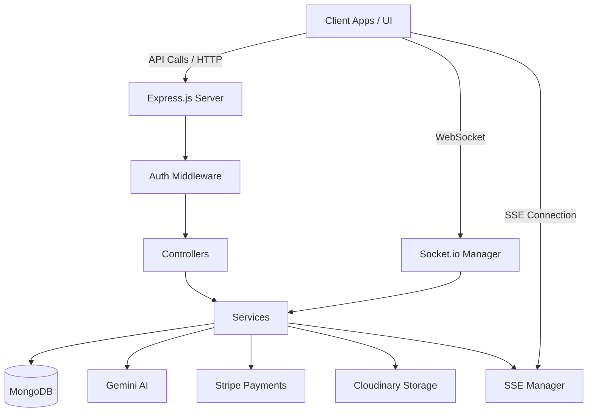

# 🏗️ Backend Architecture Guide

This document provides a deep dive into the backend architecture of the Freelance Marketplace platform. It is designed for developers who need to understand the internal systems, data flows, and design patterns.

---

## 🗺️ High-Level System Architecture

The backend is built as a **Stateless RESTful API** using the **MERN (Node/Express/Mongo)** stack.



---

## 📦 Module-Dependency Mapping

This table maps the core backend modules to the specific npm packages that power them.

| Module | Purpose | Key Dependencies |
| :--- | :--- | :--- |
| **Auth & Security** | User login, OAuth, and Token management. | `passport`, `passport-google-oauth20`, `jsonwebtoken`, `bcryptjs`, `cookie-parser` |
| **Job & Task Logic** | Complex data fetching and pagination. | `mongoose-aggregate-paginate-v2` |
| **Payments** | Stripe session handling and webhooks. | `stripe` |
| **AI Features** | Google Gemini LLM orchestration. | `@google/generative-ai` |
| **Real-time** | WebSocket and Stream management. | `socket.io` |
| **Media Handling** | File processing and Cloudinary storage. | `cloudinary`, `multer` |
| **Email System** | SMTP mailing and templates. | `nodemailer` |
| **Guardians** | Rate limiting and DDOS protection. | `rate-limiter-flexible` |
| **Core Plumbing** | Server framework and DB connection. | `express`, `mongoose`, `dotenv`, `cors` |

---

## 📂 Project Structure & Component Roles

### 1. `src/models/` (Data Intelligence) 📁

- **Purpose**: Defines the MongoDB schema and database constraints.
- **Key Models**: `User`, `Job`, `Bid`, `Task`, `Payment`, `Notification`, `ChatThread`.
- **Note**: Uses `mongoose-aggregate-paginate-v2` for high-performance complex filtering.

### 2. `src/controllers/` (Gatekeepers) 🚪

- **Purpose**: Bridge between HTTP requests and internal services.
- **Rules**:
    - Always wrapped in `asyncHandler`.
    - Handle parameter validation via `ValidationHelper`.
    - Return standardized `ApiResponse`.

### 3. `src/services/` (The Business Logic) 🧠

- **Purpose**: Complex logic that doesn't belong in controllers.
- **Core Services**:
    - **`ai.service.js`**: Orchestrates Gemini AI text/JSON generation.
    - **`notification.service.js`**: Centralized logic for dispatching both SSE and Email notifications.
    - **`chat.service.js`**: Manages message persistence and permission checks.

### 4. `src/streams/` (Real-Time Communication) 🌊

- **`SocketManager.js`**: Handles bi-directional chat. Upgrades standard HTTP connections to WebSockets.
- **`SSEManager.js`**: Manages Server-Sent Events for instant UI feedback (toasts, bid updates) without full-duplex overhead.

### 5. `src/middlewares/` (The Guardians) 🛡️

- **`auth.middleware.js`**: Validates Access Tokens from cookies/headers.
- **`rateLimiter.middleware.js`**: Prevents DDoS and manages AI service quotas using `rate-limiter-flexible`.

---

## 💰 Payment & Escrow Architecture

The platform uses a **Pseudo-Escrow** system powered by Stripe.

1.  **Funding**: Client creates a Stripe Session (`payment.controller.js`).
2.  **Confirmation**: Stripe fires a webhook to `/api/v1/payments/webhook`.
3.  **Escrow**: Backend verifies signature and moves funds to the Freelancer's `escrowBalance` in MongoDB.
4.  **Release**: Upon job completion (status: `Fulfilled`), funds move from `escrowBalance` to `availableBalance`.
5.  **Withdrawal**: Freelancers request bank payouts, recorded as `pending` in the `Payment` collection for admin processing.

---

## 🤖 AI Workflow Integration

The AI system is abstracted through `ai.service.js` and `ai.config.js`.

- **Fallback System**: The configuration allows for easy model switching (Gemini Pro, Flash, etc.).
- **JSON Enforcement**: A custom `generateJSON` utility uses prompt engineering and Regex sanitization to ensure Gemini returns valid JSON for structured data (like Task Breakdowns).

---

## 🛡️ Standardized API Response Structure

All responses follow this strict JSON format for frontend predictability:

```json
// Success
{
  "statusCode": 200,
  "data": { ... },
  "message": "Operation successful",
  "success": true
}

// Error
{
  "statusCode": 403,
  "data": null,
  "message": "Unauthorized access",
  "success": false
}
```

---

## 💡 Key Design Patterns

- **Centralized Error Handling**: Express global middleware catches all errors and converts them to formatted `ApiError` responses.
- **Service Layer Isolation**: Controllers never talk directly to AI or Stripe; they use Services to allow for easier testing and logic reuse.
- **Named Exports**: Used for all controllers and services to improve IntelliSense and maintain consistency.
- **Environment Hardening**: Crucial secrets are validated at boot-time in `index.js`.

---

## 💬 Chat & Real-time Workflow

The platform uses a **2-Model Approach** for messaging to separate context from content.

### 1. Data Models

- **`ChatThread`**: The "Room" context. Linked to a unique `jobId` and `bidId`.
- **`Message`**: Individual entries within a thread.

### 2. Access Control (Status-Gating)

Messaging is strictly governed by the state of the associated Bid:

- **Pending Bid**: Text-only negotiation allowed. Files/Media are typically blocked.
- **Accepted Bid**: Full communication unlocked (Files + Text).
- **Rejected/Withdrawn**: Thread becomes "Read-Only" to preserve record history but prevent further interaction.

### 3. Real-time Delivery Logic

The `SocketManager` tracks online status via a `Map<UserId, Set<SocketId>>`.

- If recipient is **In-Room**: Persistent message delivery via Socket.io.
- If recipient is **Global-Only**: Emits a `new_message_notification`.
- If recipient is **Offline**: Falls back to standard persistent notifications (saved to DB).
